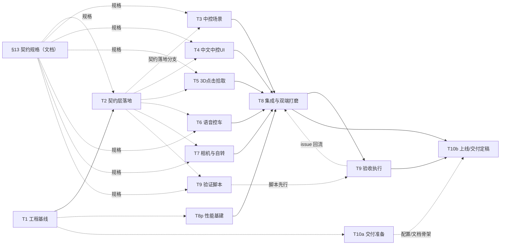
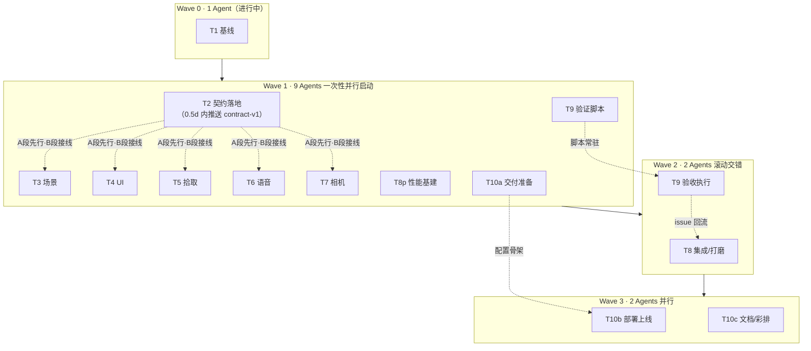

# 3D 仿真车模 Demo — 项目初步规划（Roadmap）

> 版本：v0.3（多 Agent 并行方案重构）
> 日期：2026-09-21（v0.3：2026-09-22）
> 方式：Vibe Coding（AI 驱动 + 人工协同）
> 参考开源项目：FormDrive（`D:\迅雷下载\FormDrive-main\FormDrive-main`）
>
> **阅读指引**：§1–§10 是需求与方案（第一版，仍然有效）；§11 是任务拆解与依赖拓扑；**§12 是多 Agent 并行波次方案（v0.3 重构）**；**§13 是契约规格（Wave 1 九个 Agent 的共享输入，务必先读）**。

---

## 1. 项目背景与目标

用 **Vibe Coding** 方式实现一个 **3D 仿真车模 Demo**：

| 维度 | 内容 |
| --- | --- |
| 产品形态 | 参考**新能源汽车中控大屏车模**的 3D 车模展示与交互 |
| 核心功能 | ① 车模高还原 ② 可拖动旋转 ③ 可点击控车（如车窗）④ 可语音控车（如车窗） |
| 运行形态 | 手机 + 电脑**网页直接打开** |
| 交付物 | 整个 Vibe Coding 过程的**录制视频**、**可运行 Demo**、有价值的**中间产物** |
| 考核维度 | AI 工具使用程度、AI 交互协同程度、AI 需求理解程度 |

---

## 2. 参考开源项目分析：FormDrive

### 2.1 项目定位与形态

FormDrive 是一个 **React Three Fiber 汽车配置器（Automotive Configurator）**，定位是"生产级 R3F 架构参考实现"，而非单一 3D Demo。核心能力围绕"多车型 + 外观配置 + 活动部件"展开。

**技术栈（可直接继承）：**

| 层 | 技术 | 版本 |
| --- | --- | --- |
| 应用 | React + React DOM | 19.x |
| 3D 组合 | React Three Fiber + Drei | 9.x / 10.x |
| 渲染 | Three.js（WebGPU 优先，WebGL 自动回退） | 0.180 |
| 状态 | Zustand | 5.x |
| 构建 | Vite | 7.x |
| 资源 | GLB / glTF，PBR 材质，Draco + Meshopt 解码 | — |

### 2.2 已实现能力清单（事实盘点）

基于源码逐项核实（`src/config/studioConfig.js`、`src/components/scene/VehicleModel.jsx`、`src/state/useStudioStore.js`、`src/components/ui/ControlDeck.jsx` 等）：

| # | 能力域 | 已实现内容 | 实现要点 |
| --- | --- | --- | --- |
| 1 | 3D 渲染 | WebGPU/WebGL 双通道、PBR 材质、ACES 色调映射、阴影 | `StudioCanvas.jsx` 动态创建 Renderer |
| 2 | 模型加载 | GLB + Draco + Meshopt、分阶段后台加载、字节级进度条、内存缓存 | `useVehicleGLTF.js` + `VehicleAssetLoader.jsx` |
| 3 | 车型资产 | 3 台车：Mustang GT 2005 / Tesla Model 3 2018 / K15 Concept | 均来自 Sketchfab，CC BY 4.0，GLB 7~22 MiB |
| 4 | 活动部件 | **车门**（铰链旋转）、**车窗**（下滑 + 玻璃渐隐蒙版）、**引擎盖/前备箱**、**后备箱/尾门** | `studioConfig.js` 声明 pivot；`VehicleModel.jsx` 解析 pivot + 阻尼动画 |
| 5 | 视角控制 | OrbitControls 鼠标/触控**拖拽旋转**、滚轮缩放、4 个相机预设（Studio/Front/Profile/Detail） | `CameraRig.jsx` |
| 6 | 外观配置 | 5 种涂装、光泽度滑杆、3 款轮毂 | `ControlDeck.jsx` Paint/Wheel 面板 |
| 7 | 灯光 | 3 套工作室环境（Dusk/Gallery/Noir）、大灯投影光束、尾灯发光开关 | `StudioEnvironment.jsx` + `HeadlightRig.jsx` |
| 8 | UI 界面 | 玻璃拟态英文界面、响应式（桌面/平板/手机）、键盘焦点、PNG 截图 | `tokens.css` + `style.css` |
| 9 | 工程化 | Vite 构建、CDP 浏览器自动化验证脚本（`scripts/*.mjs`）、GitHub Pages/Vercel 部署 | — |

### 2.3 FormDrive 未提供的能力（缺口事实）

| # | 能力 | FormDrive 现状 |
| --- | --- | --- |
| 1 | **语音控车** | 完全不存在（无任何语音相关代码） |
| 2 | **点击车模本体控车** | 仅底部 UI 按钮（ControlDeck → Part 面板）开关部件，无 3D 拾取（raycast） |
| 3 | **中控大屏风格场景** | 场景为"汽车配置工作室"（三套摄影棚光环境），非新能源中控大屏的深色科技感 |
| 4 | **待机自转动效** | 无（车模静态摆放，仅交互时由用户拖拽） |
| 5 | 中文界面 | 全英文 UI |
| 6 | 单车型聚焦形态 | 多车型配置器，功能面板重（Paint/Wheel/Studio/Parts 四 Tab） |

---

## 3. 当前需求 vs 开源已实现：差距分析与结论（核心章节）

> 原则：**一切以当前实际需求为锚点**。开源项目能复用的复用、能裁剪的裁剪、缺失的才自研，不做无意义的全量重写。

### 3.1 逐项对比矩阵

| 当前需求 | 需求细分解读 | FormDrive 已实现 | 差距判定 | 策略 |
| --- | --- | --- | --- | --- |
| 车模高还原（参考中控大屏） | 车型真实、材质真实、场景科技感强 | 有高质量 PBR 车模（Tesla Model 3 2018 等）+ 真实材质 | **中**：车模本体已达标，场景风格不匹配 | 复用 Tesla Model 3 GLB；改造场景为深色科技感中控风格 |
| 可拖动旋转 | 任意角度查看车模 | 已完整实现（鼠标 + 触摸 OrbitControls） | **无** | 直接继承 |
| 可点击控车（如车窗） | 直观点击车模/按钮开合车窗、车门等 | 仅底部 UI 按钮开关部件，无 3D 拾取 | **大**：交互形式不符 | 新增：点击车模部件本体（raycast 拾取）+ 保留快捷按钮双通道 |
| 可语音控车（如车窗） | 中文语音指令控车 | 完全没有 | **大**：全新能力 | 自研：Web Speech API 语音识别 + 指令映射 |
| 手机 + 电脑网页直接打开 | 无安装、双端可用 | 已响应式（含手机视口验证脚本） | **小** | 继承响应式，中文化 + 移动端触摸/布局打磨 |
| 交付 Vibe Coding 视频 | 过程可回溯 | 无关 | — | 录屏由人工本人负责，不分配给 Agent |

### 3.2 结论：继承 / 裁剪 / 新增 三份清单

**✅ 直接继承（FormDrive 已实现，完全复用）**
1. 技术栈全家桶：React 19 + R3F + Drei + Three.js + Zustand + Vite
2. 渲染管线：WebGPU 优先 / WebGL 回退、PBR、ACES、阴影
3. 模型加载管线：GLB + Draco/Meshopt、分阶段加载、进度条、缓存
4. 活动部件动画系统：pivot 解析、铰链旋转、车窗滑动 + 玻璃渐隐蒙版（核心资产）
5. OrbitControls 拖拽旋转 / 缩放
6. 响应式布局基础、验证脚本模式

**✂️ 裁剪 / 降级（非当前需求重点）**
1. 多车型选择器（当前需求聚焦单车型高还原）→ 移除或仅作可选亮点
2. Paint / Wheel / Studio 配置面板（配置器属性，非中控车模核心）→ 大幅简化或移除
3. 英文界面 → 全部中文化

**🆕 新增（本次核心增量，锚定当前需求）**
1. **语音控车模块**（核心）：Web Speech API 中文识别 + 指令集（车窗/车门/前备箱/后备箱/大灯/旋转）
2. **点击车模本体控车**：3D raycast 拾取部件 → 开合动画（对齐中控大屏"点车控车"直觉）
3. **中控大屏科技感场景**：深色渐变背景、环形光带/地面反射、氛围光，而非摄影棚
4. **待机自转动效**：静止若干秒后缓速自转，交互即停（中控大屏典型行为）
5. **中文化 UI + 语音提示反馈**：指令执行有视觉/文字反馈，双端可用
6. **移动端体验打磨**：触摸旋转灵敏度、面板布局、性能降级

---

## 4. 技术选型

| 项 | 选型 | 理由 |
| --- | --- | --- |
| 3D/渲染 | 继承 FormDrive：Three.js + R3F（WebGPU/WebGL） | 已验证的成熟管线，直接复用 |
| 语音识别 | **Web Speech API（`SpeechRecognition`，中文 `zh-CN`）** | 浏览器原生、零依赖、手机/电脑 Chrome/Edge 可用；失败降级提示 |
| 点击拾取 | R3F 原生 `onClick`（raycast） | 与现有 R3F 体系无缝集成 |
| 车模资产 | Tesla Model 3 2018 GLB（21.62 MiB，CC BY 4.0） | 新能源轿车、部件命名完整（4 门 4 窗 前后备箱），最贴近中控大屏场景 |
| 构建/部署 | Vite + 静态托管（GitHub Pages / Vercel / 本地 `dist`） | 手机电脑打开同一 URL |
| 录制 | 系统录屏（OBS 或等效工具）+ 分阶段录制 | 交付"整个 Vibe Coding 过程视频" |
| 验证 | 继承 CDP 脚本模式 + 手动浏览器双端验收 | 部件开合、语音指令、旋转逐一验证 |

> 说明：选**网页**而非安卓 App / 小程序，因需求明确"手机和电脑网页可直接打开"，网页是双端零安装的唯一形态。

---

## 5. 目标架构

继承 FormDrive 分层，新增 `voice` 与 `interaction` 模块：

```
car-display-demo/
├── public/models/            # 车模 GLB（Tesla Model 3）+ 许可文件
├── src/
│   ├── components/scene/     # Renderer、场景（中控风格）、车模、灯光、自转
│   ├── components/ui/        # 中文控制面板、语音指示器、状态反馈
│   ├── config/               # 【契约】carConfig.js：车辆部件/相机/阈值/质量分级定义
│   ├── state/                # 【契约】useCarStore.js：Zustand 全局状态（部件/灯光/相机/语音/Toast/自转）
│   ├── devtools/             # 【契约】auditHooks.js：注册式审计钩子（T9 脚本的唯一依赖面）
│   ├── interaction/          # 【新增】raycast 部件拾取 + 命中判定 + 手势判别
│   ├── voice/                # 【新增】语音识别封装 + 中文指令映射表 + 沙盒页
│   ├── perf/                 # 【新增】设备档位判定、帧率采样、性能降级
│   ├── App.jsx
│   └── style.css
├── docs/                     # 规划、Prompt 记录、过程记录、契约文档（contracts/）、验收记录
└── scripts/                  # 验证脚本（继承 + 语音/拾取/相机用例 + mock）
```

**指令流（语音/点击双通道 → 同一状态源）：**

```
[点击部件]──raycast──┐
                     ├─→ Zustand partStates ─→ VehicleModel 阻尼动画
[语音指令]──识别──┘         （单一状态源，双通道一致）
```

---

## 6. 里程碑规划（Vibe Coding 实施路线）

| 里程碑 | 目标 | 关键动作 |
| --- | --- | --- |
| **M0 准备** | 环境就绪 | Node 22 + npm；初始化项目目录 |
| **M1 跑通基线** | FormDrive 本地可运行 | `npm install && npm run dev`；确认 3D 场景、四窗四门开合、拖拽旋转 |
| **M2 中控风格改造** | 单车型 + 科技感场景 + 中文 UI + 待机自转 | 裁剪多车型/配置面板；深色场景、光带、反射地面；中文化；自转动效 |
| **M3 点击控车** | 点击车模本体开合部件 | raycast 拾取 + 命中高亮 + 开合动画；保留快捷按钮 |
| **M4 语音控车** | 中文语音指令控车 | Web Speech API + 指令映射（"打开车窗/关闭车门/开前备箱/开大灯/旋转视角"）；语音反馈 |
| **M5 双端打磨** | 手机 + 电脑可用 | 触摸优化、面板布局、性能（dpr/降级）、部署静态页 |
| **M6 交付** | 交付物齐全 | Demo 上线链接；中间产物整理（roadmap/prompt/代码/验证） |

> **里程碑与波次的对应关系**见 §12.5 的《里程碑 ↔ 波次映射》。简言之：M0/M1 在 Wave 0，M2/M3/M4 全部落在 Wave 1（九 Agent 并行），M5 在 Wave 2，M6 横跨 Wave 1（T10a）与 Wave 3（T10b/T10c）。

**语音指令集（草案，M4 细化）：**

| 指令示例 | 动作 |
| --- | --- |
| "打开车窗 / 关闭车窗" | 全部车窗开/合 |
| "打开左前门 / 关闭右后门" | 指定车门开/合 |
| "打开前备箱 / 打开后备箱" | 前/后备箱开合 |
| "打开大灯 / 关闭大灯" | 灯光开关 |
| "转一下 / 看侧面 / 看正面" | 视角控制 |
| "全部关闭" | 复位所有部件 |

---

## 7. 交付物清单

| # | 交付物 | 形态 | 说明 |
| --- | --- | --- | --- |
| 1 | **Vibe Coding 过程录制视频** | 视频文件 | 覆盖 M0→M6 关键节点，含 AI 交互协同过程（prompt→实现→验证→修正循环） |
| 2 | **可运行 Demo** | 静态网页（本地 `dist` + 可部署 URL） | 手机/电脑浏览器直接打开 |
| 3 | **中间产物** | 目录/文件 | ① 本 Roadmap ② Prompt 记录（`prompt.md`）③ 过程记录（`debug.md`）④ 源码仓库 ⑤ 验证脚本（`scripts/verify-*.mjs`）⑥ **契约文档与变更记录（`docs/contracts/`）** ⑦ **双端验收记录（`docs/qa-checklist.md` / `qa-report.md`）** ⑧ **第三方许可归属（`THIRD-PARTY.md`）** ⑨ 录制素材/剪辑工程 |

---

## 8. Vibe Coding 工作流约定（体现 AI 交互协同）

每轮迭代采用闭环：

```
明确目标（人/AI 对齐） → AI 生成/修改代码 → 人工 + AI 共同验证 → 发现偏差 → 修正 → 记录
```

1. **需求锚定**：每轮先对照 §3 差距矩阵确认"这轮做什么"，不漂移。
2. **AI 协同**：AI 负责代码生成、方案建议、排错；人负责目标确认、体验判断、方向决策。
3. **Prompt 留痕**：每轮 prompt 与决策记入 `prompt.md`；问题与解决记入 `debug.md`。
4. **小步快跑**：每里程碑一个可运行版本，先跑通再打磨。
5. **验证先行**：每完成一个能力（点击/语音/自转）立即在浏览器实测。

---

## 9. 风险与应对

| # | 风险 | 影响 | 应对 |
| --- | --- | --- | --- |
| 1 | 语音识别浏览器兼容（Safari/Firefox 不支持或需前缀） | 语音功能部分端不可用 | Chrome/Edge 为首选演示端；不兼容端优雅降级（隐藏语音入口 + 提示） |
| 2 | 车模 GLB 体积大（Tesla 21.62 MiB） | 首屏加载慢 | 继承分阶段加载 + 进度条；可尝试 Draco 压缩 |
| 3 | 部件 pivot 解析失败（模型命名不匹配） | 部件无法开合 | 沿用 FormDrive 的归一化匹配 + 预检脚本；预留手工校正配置 |
| 4 | 点击拾取命中不直观（部件小/重叠） | 交互体验差 | 命中扩大容差 + 高亮反馈 + 底部快捷按钮兜底 |
| 5 | 移动端性能不足 | 卡顿 | dpr 限制、阴影/光效降级、WebGL 回退 |
| 6 | 录制视频体积大/耗时长 | 交付困难 | 分阶段录制、关键节点剪辑、控制总时长 |
| 7 | **并行 Agent 之间的契约漂移**（v0.3 头号风险：并行度越高，契约错误放大越快） | 九条分支接线后互相不兼容，集成期集中爆雷 | ① §13 规格前置并由人评审冻结；② 契约文件由 T2 独占，其余 Agent 只读；③ 审计钩子改为**注册式**，避免多分支抢改同一文件；④ 变更一律走 `CHANGELOG.md`，只增不改；⑤ S2 准入时逐条比对规格 |
| 8 | **`contract-v1` 推送延迟**导致九个 Agent 的接线段集体堵塞 | Wave 1 整体延后 | A 段（契约无关阶段）兜底；超过 1 天未推送即人工介入，必要时把 T2 拆给第二个 Agent 分头写 config / store |
| 9 | **人的评审带宽成为新瓶颈**（九个 Agent 并发提问/送审） | 同步点排队，并行度反被浪费 | 明确人只负责三件事：§13 规格答疑、S1/S2/S3 三个闸门、方向决策；其余交由 Agent 自治 |

---

## 10. 下一步（Wave 0 / Wave 1 启动清单）

**Wave 0（T1 工程基线，进行中）**

1. [x] 确认录屏工具与录制规范（分辨率、帧率、时长目标）
2. [x] Node 22 / npm 环境检查
3. [ ] 将 FormDrive 源码作为基线复制进项目目录（保留 LICENSE 与模型许可）
4. [ ] 跑通 `npm run dev`，实测单车型 Tesla 与部件开合
5. [ ] **实测并记录 GLB 部件节点名**，回填 §13.1 的 `node` 字段（T2 的落地依据）

**Wave 1 启动前置（T1 交付后立即执行，**不要分批**）**

6. [ ] 人评审 §13 契约规格，冻结为 v1（这一步与 Wave 1 编码可并行，**不作为启动前置**）
7. [ ] 一次性拉起九个 Agent，prompt 携带：§13 规格 + 各自 A/B 段任务书 + §12.1 协作约定
8. [ ] 建立 `contract-v1` 共享分支与 `docs/contracts/CHANGELOG.md`（T2 首个交付节点）
9. [ ] 预告 S1 / S2 / S3 三个同步点的时间窗，确保人工评审带宽就位

---
---

# 第二部分：开发步骤细化、拓扑排序与多 Agent 并行规划（v0.2 增补 · v0.3 重构）

> 增补日期：2026-09-21（v0.3 并行方案重构：2026-09-22）
> 内容：将 §6 的 M0–M6 里程碑细化为 **10 个开发步骤（T1–T10）**，给出依赖拓扑（§11），并据此规划**多 Agent 并行波次方案**（§12）；另附**契约规格冻结草案**（§13），作为同一波次内全部 Agent 的共享输入。
> 事实依据：已逐文件核实 FormDrive 源码——活动部件 pivot/阻尼动画集中在 `VehicleModel.jsx`，状态集中在 `useStudioStore.js`，部件/相机/灯光定义集中在 `studioConfig.js`，相机集中在 `CameraRig.jsx`，场景集中在 `StudioEnvironment.jsx`，UI 集中在 `components/ui/*`。步骤的文件边界即按此事实划分。

### v0.3 重构说明（相对 v0.2 的关键变化）

v0.2 的波次方案虽在 Wave 2 做到 5 Agent 并行，但**波次之间仍存在两段长串行等待**：Wave 1 的 T2 契约层必须整体完成并经人工评审（S1）后，Wave 2 的五个功能 Agent 才被允许入场；Wave 3 又必须等五个分支全部就绪（S2）才能开始集成。结果是"并行只发生在中段，两头都在排队"。

v0.3 的目标是：**让每一个波次本身就是一次并行 Agent 批量启动，把串行等待压到最短**。为此做了四件事：

| # | 手段 | 效果 |
| --- | --- | --- |
| 1 | **契约规格前置**（新增 §13）：把 `carConfig` / `useCarStore` / 审计钩子的完整接口写成冻结规格文档，随本 roadmap 一起交付 | 契约的"定义"不再占用关键路径；T2 退化为"照规格落地"，其余 Agent 可**照规格直接编码** |
| 2 | **收窄 T2 文件边界**：T2 只写 `config/**` + `state/**` + `docs/contracts/**`，不再跨文件接线（原接线工作本就落在 T3/T4/T5/T7 各自要重写的文件上，零额外成本）；保留一个兼容 shim 保证工程全程可跑 | T2 与其他 Agent **文件零重叠**，得以同波次并行；T2 工作量 9→7 点，关键路径同步缩短 |
| 3 | **波次合并**：Wave 0–4（5 个波次、2 段长串行）→ Wave 0–3（4 个波次、0 段长串行） | 关键路径 46 点 → **27 点**当量，缩短约 41% |
| 4 | **Agent 常驻化 + 两段式工作法**：验证 Agent（T9）与交付 Agent（T10）跨波次常驻；每个 Wave 1 Agent 的任务书拆为「契约无关阶段」与「接线阶段」两段 | Agent 不再"等契约"，等待时间被用于推进可独立完成的工作 |

> 注：**Wave 0（T1 工程基线）已在开发中，本版不作改动**；T1 的产出与《DoD》沿用 v0.2 定义。

---

## 11. 开发步骤细化与拓扑排序

### 11.1 步骤拆分总表（T1–T10）

> 工作量点数为相对估算（1 点 ≈ 一名"人 + AI"协同开发者一轮完整 Vibe 迭代，约 0.5 人天），仅用于步骤均衡与排期，不代表承诺工时。v0.3 共 **13 个步骤行**（T1–T10，其中 T10 拆为 T10a/b/c，另新增 T8p），合计 **78 点**，单步 2–9 点。**点数只用于判断"波次内谁是最长的那根柱子"，不用于承诺工期。**

| 编号 | 步骤名称 | 对应里程碑 | 目标 | 主要工作 | 主要文件（新增/改造） | 输入依赖 | 产出与完成标准（DoD） | 点数 |
| --- | --- | --- | --- | --- | --- | --- | --- | --- |
| **T1** | 工程基线与单车型固化 | M0–M1 | 得到可运行的 Tesla 单车基线 | ① FormDrive 复制进 `D:\car_display\app`，保留 `LICENSE` 与 `TESLA-LICENSE.md`；② `npm install`；③ 仅保留 `tesla-model-3-2018.glb`，删除 mustang/concept 资产与车型选择器入口，默认车型 tesla；④ 跑通 dev/build，手机同局域网访问 `--host` URL；⑤ 初始化 `prompt.md`/`debug.md` | 工程根配置、`public/models/*`、`studioConfig.js`（最小裁剪）、`App.jsx`（临时摘除 VehicleSelector） | FormDrive 源码仓 | 桌面/手机打开仅 Tesla 一台车；四门四窗、前后备箱、灯光、拖拽旋转可用；`npm run build` 通过 | 6 |
| **T2** | 契约层重构（config + store + 审计钩子，**仅限契约文件**） | M2 骨架 | 按 §13 规格落地冻结的数据/行为契约，工程保持可跑 | ① `studioConfig.js` → `config/carConfig.js`：仅 Tesla，**部件 id 按 §13.1 冻结**（`window_lf`/`door_lf`/`frunk`/`trunk` 等逻辑 id，供全局引用），`node` 字段填 GLB 实测节点名（`door_lf_dummy` 等）；中文 label + 别名；分组 `windows/doors/closures` + 独立 `LIGHTS` 表；视角预设中文；`INTERACTION` 阈值块、`QUALITY` 分级块（字段见 §13.1）；② `useStudioStore.js` → `state/useCarStore.js`：删除 paint/wheel/多车型/studio 字段；落地 §13.2 全部 state 片与 action（`part/light/camera/toast/voice/autoRotate`）；③ 注册 §13.3 三个审计钩子 + 语音注入点；④ **保留 `state/useStudioStore.js` 为兼容 shim**（旧导出名/旧字段映射到新 store，约 30 行），使旧组件在 T3–T7 接线完成前仍可编译运行，**不做任何跨文件接线**（VehicleModel→T5、CameraRig→T7、HeadlightRig→T3、UI→T4 各自在其归属分支内完成）；⑤ 产出 **`docs/contracts/store-contract.md`**（以 §13 为骨架，补齐实测细节；冻结后**只增不改**） | `config/*`、`state/*`、`devtools/auditHooks.js`、`docs/contracts/store-contract.md` | T1 | dev/build 通过；不依赖新 UI，仅凭 store（控制台/临时按钮）即可驱动部件、灯光、视角；契约文档经人工评审冻结（同步点 **S1**，波次内闸门） | 7 |
| **T3** | 中控大屏风格视觉场景 | M2 | 把"摄影棚"换成新能源中控大屏的深色科技感 | ① `StudioEnvironment` → `CockpitEnvironment`：深色径向渐变背景、青蓝氛围光与轮廓光、环形光带 + 科技网格地面、镜面反射地面（drei `MeshReflectorMaterial`，**预留 quality 降级开关**供 T8 使用）、可选轻微扫光；② `HeadlightRig` 固定 tesla 锚点，**并自行完成本文件对新 store 的接线**（T2 不代做）；③ 移除三套摄影棚切换与调色 fog；④ 少量样式用独立 css、类名前缀 `cd-env-` | `scene/CockpitEnvironment.jsx`、`scene/ground/*`、`HeadlightRig.jsx` 改造 | §13 契约规格（**不等待 T2 代码**）+ T2 落地分支 | 视觉对标中控大屏（深色底、车身高光、地面反射、环形光带）；桌面 WebGL 稳定 60fps；build 通过；**不改 App.jsx**，交付挂载说明 | 8 |
| **T4** | 中文中控 UI（面板 / Toast / 加载页 / 主题） | M2、M3 界面 | 移除英文配置器 UI，落地中控风中文界面 | ① 移除 Navigation/HeroCopy/VehicleSelector/ControlDeck/InfoDialog 等配置器组件；② 新建：车辆状态标题、部件控制组（车窗×4、车门×4、前备箱、后备箱）、大灯/尾灯开关、视角按钮（正面/侧面/环绕/复位 → cameraCommand）、一键"全部关闭"；③ `ToastHost` 订阅 store.toast 显示执行反馈；④ 重写中文加载页（保留字节级进度）与中文手势提示；⑤ `tokens.css`/`style.css` 深色中控主题（深灰蓝黑底 + 青色/冰蓝点缀、玻璃拟态卡片）；⑥ 桌面侧栏 / 手机底栏响应式雏形（精细打磨归 T8）；⑦ 为 T6 的 VoiceButton 预留容器位，不实现语音逻辑；⑧ **自行完成 `ui/**` 对新 store 的接线**（T2 不代做） | `ui/ControlPanel.jsx`、`ui/PartButton.jsx`、`ui/ToastHost.jsx`、`ui/LoadingScreen.jsx`、`tokens.css`、`style.css` | §13 契约规格 + T2 落地分支 | 所有 store 动作均有中文入口；无英文残留；375px 手机视口布局不破；build 通过 | 8 |
| **T5** | 3D 点击拾取控车（raycast） | M3 | 实现"点车模本体控车" | ① `interaction/` 模块：为每个可交互部件建立命中目标（pivot 子 mesh 集合；薄玻璃配隐形加厚命中体或 raycast threshold 扩容器差）；② 点击/拖拽手势判别（pointerdown→up 位移+时长阈值，OrbitControls 旋转中不触发，触摸同理）；③ 悬停高亮（emissive 提亮或 drei `Outlines`）+ pointer 光标 + 中文部件名 tooltip；④ 命中点反查 partKey → `togglePart`/灯光；⑤ 每次交互 `bumpInteraction()` + `pushToast("左前车窗已打开")`；⑥ 审计钩子按 §13.3 追加 `hitTargets`（部件包围盒 + 屏幕坐标，供 T9 的 CDP 脚本精准点击）；⑦ **自行完成 `VehicleModel.jsx` 对新 store 的接线**（T2 不代做） | `interaction/usePartPick.js`、`interaction/PartHitAreas.jsx`、`interaction/partMapping.js`、**`VehicleModel.jsx` 改造（全波次唯一修改方）** | §13 契约规格 + T2 落地分支 | 桌面点击/手机点按可开合 10 个部件 + 大灯；拖拽旋转不误触发；玻璃部件点中率 ≥90%；高亮反馈明确；build 通过 | 9 |
| **T6** | 语音控车引擎（Web Speech API） | M4 | 中文语音指令 → store 动作，端到端自测通过 | ① `SpeechRecognition` 兼容封装（webkit 前缀、能力探测、权限请求、错误重试、安全上下文检测）；② `parseCommand`：按 carConfig 的中文 label/别名表解析"开/关/打开/关闭/关上" + 部位（车窗/窗户/玻璃、左前/右后车门、前备箱/前舱、后备箱/尾箱、大灯/车灯、尾灯）+ 范围（全部/所有/四个）+ 视角（转一下/转一圈、看侧面/侧面、看正面/正面、复位）+ 全局（全部关闭），输出动作计划 `[{type:'part'/'group'/'light'/'camera', ...}]` 并执行；③ `useVoiceControl` 状态机接入 store.voice + toast；④ 交付自带独立样式（`cd-voice-` 前缀、`voice.css`）的 `VoiceButton`（录音波纹、实时字幕、状态文案、不支持端降级提示）；⑤ `voice.sandbox.html` 独立自测页（Vite 多页入口，不碰 App）；⑥ 可选 SpeechSynthesis 语音播报开关；⑦ 按 §13.3 暴露 `window.__carDisplayVoiceInject(ctor)` 注入点（供 T9 的语音 mock 回放指令集，**与 T9 同波次并行开发，接口先冻结**） | `voice/recognition.js`、`voice/commands.js`（指令词/别名表）、`voice/parseCommand.js`、`voice/useVoiceControl.js`、`voice/VoiceButton.jsx`、`voice/voice.css`、`voice/voice.sandbox.html` | §13 契约规格 + §6 指令集 + T2 落地分支 | 沙盒页 + 真机 Chrome/Edge 中 §6 指令集全部识别正确，含权限拒绝/不支持的降级路径；不改 store 与 App；build 通过 | 9 |
| **T7** | 相机指令化与待机自转 | M2 | 视角可被按钮/语音驱动，具备中控式待机自转 | ① CameraRig 改为 store 驱动：hero/front/profile 预设平滑切换 + `cameraCommand='orbit-once'`（"转一下"：绕车缓转一周回正，damp 曲线）；② 新增 `IdleAutoRotate`：空闲约 8 秒（无 `bumpInteraction`）后缓速自转，任意指针/按键/指令即停并重置计时；③ 自转、环绕、用户拖拽三者互斥（自转时临时接管/禁用 OrbitControls 冲突项）；④ `__carDisplayCameraAudit()` 按 §13.3 增加 `autoRotating` / `orbiting` 字段；⑤ **自行完成 `CameraRig.jsx` 对新 store 的接线**（T2 不代做） | `scene/CameraRig.jsx`（独占）、`scene/IdleAutoRotate.jsx` | §13 契约规格 + T2 落地分支 | 拖拽/缩放正常；待机自转、交互即停；"转一下"环绕一周回正；正面/侧面预设平滑到位；build 通过 | 6 |
| **T8p** | 性能与移动端基建（**契约无关，可独立开工**） | M5 | 把性能分级做成独立模块，从集成瓶颈中拆出 | ① `perf/deviceTier.js`：按 UA/dpr/`hardwareConcurrency`/内存初判档位（`high/mid/low`）；② `perf/fpsSampler.js`：运行时帧率采样，连续低于阈值自动降档，并为 `__carDisplaySceneAudit().perf` 提供 `{fps,dpr,tier}` 数据源（§13.3）；③ `perf/useDeviceTier.js` + `PerfProvider.jsx`：Context 提供 `tier`/`setTier`，并作为 `carConfig.quality` 的**唯一消费端**（只读，不改 config）；④ `perf/WebGLFallback.jsx`：WebGL 不可用时的中文降级提示页 | `perf/**`（全新目录） | T1 基线（**不依赖 T2 契约**） | 在 T1 基线上独立可运行，`useDeviceTier()` 返回正确档位并在低帧率时降档；不改 App.jsx（自测用临时挂载，只交挂载说明）；build 通过 | 4 |
| **T8** | 集成组装 + 移动端/性能打磨 | M5 | 五条功能分支 + 性能模块合为一体，双端达标 | ① 统一改写 `App.jsx`/`main.jsx` 组装全部新组件（Wave 1 各 Agent 一律不改 App，挂载集中在此）；② 双通道一致性联调（点击/语音/按钮 → 同一 store → 阻尼动画 + Toast 一致）；③ 主题收口（T3/T6 独立 css 对齐 T4 的 token）；④ 移动端：触摸旋转灵敏度、点按命中阈值联调、底栏安全区、麦克风权限引导、安全上下文提示；⑤ **接线 T8p 的 `PerfProvider` 并真机实测调参**（dpr 上限、反射地面/阴影/扫光降级、21 MiB GLB 加载实测）；⑥ 修复 T9 回流问题 | `App.jsx`、`main.jsx`、`style.css` 响应式段、各模块集成期小修（拥有集成期修改权） | T3、T4、T5、T6、T7、T8p 全部交付 | 桌面 Chrome/Edge 与手机 Chrome 全功能清单通过；桌面 ≥55fps、手机 ≥30fps；首屏加载有进度反馈；build 产物手机可访问 | 7 |
| **T9** | 自动化验证 + 双端验收 | M5–M6 | 能力可回归、双端有验收记录 | 继承 FormDrive CDP 脚本模式：① `verify-parts.mjs`（经 `__carDisplayStore` 逐一驱动 10 部件+灯光，读 sceneAudit 断言终态）；② `verify-pick.mjs`（用 hitTargets 包围盒派发 CDP 鼠标/触摸事件，断言开合翻转；含"拖拽不触发点击"用例）；③ `verify-voice.mjs`（注入 mock SpeechRecognition 回放 §6 指令集，断言 store 动作与 toast）；④ `verify-camera.mjs`（预设/环绕/待机自转）；⑤ `docs/qa-checklist.md` 双端人工清单（含真机语音项）并执行出 `qa-report.md`，问题回流 T8、修复后回归。**脚本编写段（Wave 1）与验收执行段（Wave 2）由同一常驻 Agent 连续承担** | `scripts/verify-*.mjs`、`scripts/mocks/speech-recognition-mock.js`、`docs/qa-checklist.md`、`docs/qa-report.md` | §13 契约规格（脚本即可开工，**与 T2 同波次**）；T8（验收执行） | 本地脚本全绿（语音 mock 绿 + 真机人工勾选）；双端清单逐项记录；P0/P1 issue 全部关闭（同步点 S3） | 7 |
| **T10a** | 交付准备（**契约无关，可独立开工**） | M6 前置 | 把部署配置与文档骨架从交付瓶颈中拆出 | ① `vite.config.js` 设 `base:'./'`（相对路径，dist 本地静态打开与托管两可）并验证 dist 可离线打开；② 新建 `vercel.json` / GitHub Pages workflow；③ `readme.md` 骨架（运行/部署/演示话术占位）；④ `docs/release-notes.md` 骨架；⑤ **第三方许可归属**：校对 `public/models/*-LICENSE*`、新建 `THIRD-PARTY.md` 汇总 FormDrive 与三台车模的 CC BY 4.0 归属 | `vite.config.js`、`vercel.json`、`.github/workflows/*`、`readme.md`、`docs/release-notes.md`、`THIRD-PARTY.md` | T1 基线（**不依赖任何功能分支**） | dist 可离线打开；许可归属逐项可追溯；文档骨架就位；不改 `App.jsx` | 3 |
| **T10b** | 上线部署 | M6 | 公网可访问 | ① 按 T10a 的配置部署 https 静态托管（Vercel/GitHub Pages，手机电脑同一 URL；**https 是手机语音识别的硬性条件**）；② 保留并验证 dist 离线包；③ 真机 URL 复验四项核心功能，产出 `docs/release-notes.md` 的部署章节 | 部署配置、`dist/`、`docs/release-notes.md`（部署段） | T8、T9（S3 冻结代码）+ T10a | 公网 URL 在手机/电脑打开，拖拽/点击/语音/场景四项核心功能可用（语音限 Chrome/Edge 并优雅降级） | 2 |
| **T10c** | 文档定稿与最终彩排 | M6 | §7 交付物齐备 | ① 文档定稿：roadmap、`prompt.md`、`debug.md`、`readme.md` 补全（运行/部署/演示话术）；② 按演示话术完整走一遍彩排并留彩排记录；③ 录制素材/剪辑工程清单与归档说明；④ 逐项核对 §7 交付物清单 | `readme.md`、`docs/*.md`、`docs/release-notes.md`（非部署段） | T8、T9 + T10a | §7 清单逐项可追溯；彩排记录完整 | 2 |

**工作量合计 78 点**（v0.2 为 77 点）。v0.3 的增删：新增 T8p 4 点、T10a 3 点；T2 由 9 降为 7（跨文件接线移交各归属 Agent，零额外成本）、T8 由 8 降为 7（性能基建外移）、T10 由 7 拆为 T10a 3 + T10b 2 + T10c 2（合计不变）。单步最大 9 / 最小 2；**T2 由"并行契约基石"退化为"照 §13 规格落地"，不再是最重的串行瓶颈**。

### 11.2 依赖关系与拓扑排序

**依赖边清单：**

| 前驱 | 后继 | 依赖性质 |
| --- | --- | --- |
| T1 | T2 | 强依赖：契约重构必须在可运行基线之上 |
| T1 | T8p、T10a | **弱依赖（虚线）**：二者只依赖基线工程，与 T2 同波次并行 |
| §13 契约规格（随 roadmap 交付） | T2、T3、T4、T5、T6、T7、T9 | **规格依赖**：只依赖冻结的接口定义，**不依赖对方代码**——这是 v0.3 得以同波次并行的根本依据 |
| T2 | T3、T4、T5、T6、T7、T9 | **弱依赖（虚线）**：各 Agent 先做「契约无关阶段」，再 rebase 到 T2 落地分支进入「接线阶段」；**同波次内消化，不构成波次边界** |
| T3、T4、T5、T6、T7、T8p | T8 | 强依赖：集成组装必须等六条分支交付 |
| T8 | T9（验收执行段） | 强依赖：完整 App 才能跑拾取/语音/双端验收 |
| T9 | T8 | 反馈环：issue 回流修复后再回归 |
| T10a | T10b | 弱依赖：部署配置与文档骨架先行产出，T10b 直接复用 |
| T8、T9 | T10b | 强依赖：功能冻结、验收通过才能上线与交付定稿 |

**依赖拓扑图：**



纯文本视图（防止 Mermaid 不渲染）：

```
                      ┌─▶ T2 (契约落地)  ·······▶ 各 Agent 接线阶段
T1 ──┬─▶ §13 规格 ────┤
     │                └─▶ T3/T4/T5/T6/T7/T9（契约无关阶段先行）
     ├─▶ T8p (性能基建) ─┐
     ├─▶ T10a(交付准备) ─┤
     └──────────────────┼─▶ T8 (集成/打磨) ─▶ T9(执行验收) ─▶ T10b
                        │        ▲                │
                        └────────┴──── issue 回流 ─┘
```

**一种合法拓扑序列（Kahn 线性化，同层任务次序可互换）：**

```
Wave 1：T1 → [ T2 ∥ T3 ∥ T4 ∥ T5 ∥ T6 ∥ T7 ∥ T9(脚本) ∥ T8p ∥ T10a ]
Wave 2：[ T8 ∥ T9(验收执行，随 T8 每次合并滚动跟进) ]
Wave 3：[ T10b ]
```

**关键路径：** `T1(6) → Wave 1 最长任务 T5/T6(9) → Wave 2 的 T8(7) + T9 执行段(≈3) → T10b(2)`，关键链合计约 **27 点**当量（v0.2 为 46 点，缩短约 41%）。

### 11.3 拓扑排序的推导原则

1. **规格先行，而非实现先行（v0.3 核心原则）**：把契约的「定义」与「落地」彻底分离。定义写成 §13 的冻结规格，随 roadmap 一次交付、零等待；落地（T2）退化为"照规格填空"。这样 `carConfig.js` / `useCarStore.js` 虽然是所有模块的读写中心，却不再制造排队——**因为消费方需要的是字段名与 action 签名，而这些在规格里已经确定**。
2. **按"文件独占"判定可并行**：T3–T7 各自新增独立目录（`voice/`、`interaction/`、`ground`、`perf`），对必须改造的共享文件提前授权唯一归属（`VehicleModel.jsx`→T5、`CameraRig.jsx`→T7、`style.css`/`tokens.css`/`ui/*`→T4、环境/灯光→T3），并约定 **Wave 1 一律不改 `App.jsx`**，由此九个任务文件零重叠、可同波并行。T2 的文件边界同步收窄到 `config/**` + `state/**` + `devtools/**`，不再跨文件接线（接线本就落在各归属 Agent 要重写的文件上，零额外成本）。
3. **契约实现与契约消费同波次并行（两段式工作法）**：每个消费方 Agent 的任务书拆为两段——
   - **A 段「契约无关阶段」**：不读 store 也能推进的真实工作量。如 T5 的拾取几何与手势判别、T6 的识别封装与指令词表、T3 的场景几何与材质、T7 的阻尼曲线与空闲定时器、T4 的组件骨架与主题 token、T8p 的档位判定与帧率采样。
   - **B 段「接线阶段」**：`git fetch` 拉取 T2 的落地分支后接线自测。
   等待 T2 的时间被用于推进 A 段，**排队时间 ≈ 0**。
4. **集成与验证收口，验证双段左移**：T9 拆成"脚本编写"（Wave 1，与 T2 并行）与"验收执行"（Wave 2，与 T8 滚动并行——T8 每合并一条分支，T9 立即跑对应脚本），把"集成后才发现问题"变成"合并当场暴露"。
5. **瓶颈外移**：把 T8 中与集成无关的性能基建（T8p）、与代码无关的交付准备（T10a）提前到 Wave 1 并行完成，压缩 Wave 2/Wave 3 的串行段。

---

## 12. 多 Agent 并行开发规划（每个 Agent 1M 上下文）

### 12.1 并行前提与协作约定

- **上下文容量核对**：FormDrive `src/` 全部源码约 1500 行（最大单文件 `VehicleModel.jsx` 约 330 行、`style.css` 约 31 KB），GLB 为二进制不读入上下文。任一任务（T1–T10）所需"基线代码 + §13 规格 + 自测迭代记录"均远小于 1M token，单 Agent 可独立闭环。
- **【v0.3 新增】规格前置**：§13 是**冻结的接口规格**，随本 roadmap 一起交付，是 Wave 1 全部 Agent 的共享输入。**任何 Agent 编码前先读 §13，而不是等 T2 的代码**。规格由人（项目 owner）评审后即为 v1，Agent 无权私改。
- **【v0.3 新增】两段式工作法**：每个消费方 Agent 的任务书都拆为 **A 段「契约无关阶段」** 与 **B 段「接线阶段」**（见各 Agent 任务书）。启动即做 A 段；B 段的开始信号是 **T2 把契约提交推送到共享分支 `contract-v1`**（不等人评审，评审只卡"冻结确认"不卡"接线"）。
- **【v0.3 新增】共享分支 `contract-v1`**：T2 Agent 在 Wave 1 内的**第一个交付节点**（建议启动后 0.5 天内）必须把 `carConfig.js` + `useCarStore.js` + `devtools/auditHooks.js` + 兼容 shim 提交并推送到 `contract-v1` 分支，并在 `docs/contracts/CHANGELOG.md` 记一行。其余 Agent 的 B 段基于该分支 rebase；此后 `contract-v1` 对 T2 之外的人**只读**。
- **【v0.3 新增】常驻 Agent**：**验证 Agent（T9）** 跨 Wave 1/Wave 2 常驻（脚本段 → 执行段），**交付 Agent（T10）** 跨 Wave 1/Wave 3 常驻（T10a → T10b），复用同一份上下文，避免知识丢失。
- **Git worktree 隔离**：Wave 1 的每个 Agent 各开一个 worktree/分支（`wave1/t2`、`wave1/t3` … `wave1/t10a`）。A 段基于 T1 的基线提交，B 段 rebase 到 `contract-v1`。T8 在集成分支逐分支合并——因文件独占矩阵不重叠，预期无内容冲突，唯一统一改写点是 `App.jsx`。
- **契约冻结纪律**：`carConfig.js`、`useCarStore.js`、全局审计钩子在 `contract-v1` 推送后对 T2 之外只读；字段不够用时统一登记 `docs/contracts/CHANGELOG.md`，遵循"**只增字段、不改既有语义**"，由 T2 的 owner（或 T8 集成 Agent）受理，禁止各 Agent 私改 store。**规格本身（§13）的修改只能由人在同步点 S1 拍板。**
- **每个 Agent 的标准交付物**：① build 通过的分支代码；② 自测记录（追加到 `debug.md` 对应段落）；③ 给 T8 的《挂载/接入说明》片段（组件 import 路径、props、挂载位置、css 引入）。
- **命名隔离**：css 类名前缀（`cd-env-` / `cd-ui-` / `cd-hit-` / `cd-voice-` / `cd-cam-` / `cd-perf-`）；全局钩子与调试对象统一 `__carDisplay*` 前缀。
- **依赖冻结**：原则上**零新增 npm 依赖**（反射地面、描边 drei 已提供；语音用浏览器原生 API）。**Wave 1 不得改 `package.json`、`App.jsx`、`main.jsx`**；确需新依赖须在 Wave 1 启动前申报并由 T1/T2 阶段装入。
- **自测临时改动规则**：允许在各自 worktree 内临时改 `App.jsx` 挂载自测，但该改动不随分支交付，改为在《挂载说明》中描述，避免多个分支同时改 App 造成冲突。
- **【v0.3 新增】波次内滚动验收**：T9 不等到 Wave 2 末尾才动手，而是**跟随 T8 的每一次分支合并滚动跑脚本**，问题即时回流。这让"集成"与"验收"在同一波次内交错推进，而非前后排队。

### 12.2 文件独占矩阵（● 新建/改造　○ 只读/仅接线　– 不涉及　禁改）

> 列顺序即 Wave 1 的九个 Agent（T2→T10a）+ Wave 2 的 T8/T9 + Wave 3 的 T10b。**● = 独占写权限　○ = 只读/仅接线　– = 不涉及　禁改 = 明确禁止**

| 文件 / 目录 | T1 | T2 | T3 | T4 | T5 | T6 | T7 | T8p | T9 | T10a | T8 | T10b |
| --- | --- | --- | --- | --- | --- | --- | --- | --- | --- | --- | --- | --- |
| 工程配置 / `package.json` / Vite | ● | ○ | – | – | – | – | – | – | – | ●`base` | ○ | ○ |
| `public/models/tesla-*`（含许可） | ● | ○ | – | – | – | – | – | – | – | ○校对 | – | ○ |
| `config/carConfig.js`（由 studioConfig 重构） | ●裁剪 | ●重写冻结 | ○ | ○ | ○ | ○ | ○ | ○只读 | ○ | – | ○ | – |
| `state/useCarStore.js`（由 useStudioStore 重构） | – | ●重写冻结 | ○ | ○ | ○ | ○ | ○ | – | ○ | – | ○ | – |
| `state/useStudioStore.js`（**兼容 shim**） | – | ●新建 | ○ | ○ | ○ | ○ | ○ | – | – | – | ●删除 | – |
| `devtools/auditHooks.js`（注册式审计钩子） | – | ●新建冻结 | ○ | ○ | ○注册 | ○注册 | ○注册 | ○注册 | ○ | – | ○ | – |
| `docs/contracts/store-contract.md`、`CHANGELOG.md` | – | ●编写 | ○ | ○ | ○ | ○ | ○ | ○ | ○ | – | ●CHANGELOG | – |
| `scene/CockpitEnvironment*`、地面/光带、`HeadlightRig.jsx` | – | ○ | ●独占 | – | – | – | – | – | – | – | ○ | – |
| `ui/**`（新中控面板、Toast、加载页）、`tokens.css`、`style.css` | – | ○ | – | ●独占 | – | – | – | – | – | – | ●响应式收口 | – |
| `scene/VehicleModel.jsx` | – | ○ | – | – | ●独占 | – | – | – | ○ | – | ○ | – |
| `interaction/**` | – | – | – | – | ●独占 | – | – | – | ○ | – | ○ | – |
| `voice/**`（含 VoiceButton、sandbox 页） | – | – | – | ○仅挂载容器 | – | ●独占 | – | – | ○ | – | ○ | – |
| `scene/CameraRig.jsx`、`scene/IdleAutoRotate.jsx` | – | ○ | – | – | – | – | ●独占 | – | ○ | – | ○ | – |
| `perf/**`（档位判定、帧率采样、降级页） | – | ○ | – | – | – | – | – | ●独占 | – | – | ○接线 | – |
| `App.jsx` / `main.jsx` | ●临时 | 禁改 | 禁改 | 禁改 | 禁改 | 禁改 | 禁改 | 禁改 | – | – | ●统一组装 | – |
| `scripts/verify-*.mjs`、mocks | – | ○钩子契约 | – | – | ○钩子 | – | – | – | ●独占 | – | – | – |
| `docs/qa-*.md` | – | – | – | – | – | – | – | – | ●独占 | – | 配合 | – |
| `readme.md`、`docs/release-notes.md`、`THIRD-PARTY.md` | – | – | – | – | – | – | – | – | – | ●骨架 | – | ●定稿 |
| 部署配置 / `dist/` | – | – | – | – | – | – | – | – | – | ●配置 | – | ●上线 |

**矩阵可并行性自检：Wave 1 九个 Agent 的 ● 单元格两两不重叠**（T2 的 `config`/`state`/`devtools`/`docs/contracts` 与其余八个的目录互不相交），因此九条分支可同时开工、同时合并。

### 12.3 并行波次与 Agent 任务书（v0.3）

> **波次的定义（v0.3 起）**：一个波次 = **一次并行的 Agent 批量启动**。波次之间只保留"可合并性闸门"（分支是否达标、能否合并），不保留"排队等待"；波次内部不设阻塞式同步点。

#### 12.3.0 波次总览与 v0.2 对照

| 波次 | 启动时机 | Agent 数 | 构成 | 波次出口 |
| --- | --- | --- | --- | --- |
| **Wave 0** | 进行中 | 1 | T1 工程基线 | 单车型 Tesla 基线分支（dev/build 双绿、手机可访问） |
| **Wave 1** | T1 交付后**一次性拉起** | **9（全并行）** | T2 ∥ T3 ∥ T4 ∥ T5 ∥ T6 ∥ T7 ∥ T9（脚本段） ∥ T8p ∥ T10a | 契约冻结 + 五条功能分支 + 性能模块 + 验证脚本 + 交付骨架 |
| **Wave 2** | Wave 1 分支准入（S2）后 | 2（并行，滚动交错） | T8 集成组装 ∥ T9 验收执行 | 完整 App 双端达标、脚本全绿、P0/P1 清零（S3） |
| **Wave 3** | S3 后 | 2（并行） | T10b 部署上线 ∥ T10c 文档定稿与彩排 | 在线 Demo + §7 交付物齐备 |

**与 v0.2 的波次对照（5 个波次 → 4 个，两段长串行 → 0 段）：**

| v0.2 | v0.3 | 变化原因 |
| --- | --- | --- |
| Wave 1（T2 串行）+ Wave 2（T3–T7 五并行） | **合并为 Wave 1（九 Agent 并行）** | 契约规格前置（§13）+ T2 文件边界收窄，契约的"实现"与"消费"可在同一波次内并行 |
| Wave 3 中的 T9 脚本段 | 并入 Wave 1 | 脚本只依赖 §13 的钩子与注入点定义，无需与 T2 分波 |
| Wave 4（T10 单 Agent 串行） | **拆入 Wave 1（T10a）+ Wave 3（T10b/T10c）** | 部署配置与文档骨架不依赖任何功能代码，属纯瓶颈外移 |

---

#### Wave 0 — 1 个 Agent：T1 工程基线（**已在开发中，本版不作改动**）

- **输入上下文**：本 roadmap §1–§10、FormDrive 全仓源码。
- **出口**：单车型 Tesla 基线分支（dev/build 双绿、手机可访问）、`prompt.md`/`debug.md` 骨架。
- **启动 Wave 1 的唯一条件**：T1 分支的 `npm run build` 全绿且已合入 `main`。**满足即拉起 Wave 1，不需要任何其他前置。**

---

#### Wave 1 — 9 个 Agent 完全并行：T2 / T3 / T4 / T5 / T6 / T7 / T9 / T8p / T10a

**共同输入（九个 Agent 人手一份，无需互相等待）：**
1. **§13 契约规格（冻结草案）** —— 本 roadmap 附件，接口定义的全部依据；
2. T1 基线分支（A 段的开发基座）；
3. 各自的《任务书》（下表）与 §3.2 继承/裁剪/新增清单、§6 语音指令集。

**两段式工作法（每个 Agent 都按此执行）：**

- **A 段「契约无关阶段」**：启动即做。不读 store 也能推进的真实工作量（几何、词表、样式、曲线、判定逻辑……）。产出可独立自测、可独立提交。
- **B 段「接线阶段」**：`git fetch origin contract-v1` → rebase → 把 A 段成果接到真实 store 上 → 端到端自测 → 交付分支。
- 若 A 段做完而 `contract-v1` 尚未推送：**不要空转**，转为补齐自测记录、撰写《挂载说明》、加固边界用例。

| Agent | 任务 | A 段「契约无关阶段」（启动即做） | B 段「接线阶段」（contract-v1 就绪后） | 出口要点（DoD） |
| --- | --- | --- | --- | --- |
| **Agent-契约** | T2 契约层落地 | —（本任务即契约本身，**最高优先级：0.5 天内推送 `contract-v1`**） | 自查 `store-contract.md` 与 §13 逐条对齐 | `carConfig.js` + `useCarStore.js` + `auditHooks.js` + 兼容 shim 落地；dev/build 双绿；`store-contract.md` 覆盖 §13 全部字段与钩子 |
| **Agent-场景** | T3 中控场景 | 深色径向渐变背景、青蓝氛围光与轮廓光、环形光带、科技网格地面、`MeshReflectorMaterial` 反射地面（含 `quality` 降级开关）、光效调参 | `HeadlightRig` 接新 store 的灯光状态；按 `carConfig.quality` 读降级字段 | 视觉对标中控大屏；桌面 WebGL 稳定 60fps；**不改 App.jsx**；交《挂载说明》 |
| **Agent-UI** | T4 中文中控界面 | `ControlPanel` / `PartButton` / `ToastHost` / `LoadingScreen` 组件骨架（props 驱动、不接 store）、`tokens.css` 深色中控主题、中文文案表、响应式布局雏形 | `ui/**` 全部接新 store（part/light/camera/toast 全量 action）；摘除 paint/wheel/studio 入口；VoiceButton 容器位 | 所有 store 动作均有中文入口；无英文残留；375px 手机视口布局不破 |
| **Agent-交互** | T5 点击拾取 | 拾取几何（pivot 子 mesh 收集、薄玻璃加厚命中体）、手势判别（位移/时长阈值）、悬停高亮与光标、中文部件名 tooltip、命中点反查 partKey | `VehicleModel.jsx` 接新 store（`togglePart`）；向 `auditHooks` **注册** `hitTargets`；按 `carConfig.interaction` 读阈值 | 桌面点击/手机点按可开合 10 部件 + 大灯；拖拽不误触发；玻璃点中率 ≥90% |
| **Agent-语音** | T6 语音控车 | `SpeechRecognition` 兼容封装（webkit 前缀、能力探测、权限、重试、安全上下文检测）、指令词表与别名表、`parseCommand` 纯函数 + 用例、`VoiceButton` 样式动效、`voice.sandbox.html` | `useVoiceControl` 接 `store.voice` 与 toast；暴露 `window.__carDisplayVoiceInject`（§13.3） | 沙盒页 + 真机 Chrome/Edge 下 §6 指令集全部识别正确，含权限拒绝/不支持的降级路径 |
| **Agent-相机** | T7 相机与自转 | 阻尼曲线与预设插值、`IdleAutoRotate` 空闲定时器与互斥状态机、`orbit-once` 环绕路径 | `CameraRig.jsx` 接新 store（`cameraView`/`cameraCommand`）；向 `auditHooks` **注册** `autoRotating`/`orbiting` | 拖拽缩放正常；待机自转、交互即停；"转一下"环绕一周回正 |
| **Agent-验证**（常驻） | T9 脚本段 | 四个 `verify-*.mjs` + 语音 mock + 双端验收清单 —— **全部只依赖 §13 的钩子/注入点定义，不依赖任何实现** | 在 `contract-v1` 上先跑通 `verify-parts` / `verify-voice` 的契约层断言 | 脚本、mock、清单就绪；契约层断言可跑 |
| **Agent-性能** | T8p 性能基建 | `deviceTier` 档位判定、`fpsSampler` 帧率采样与自动降档、`PerfProvider`、`WebGLFallback` —— **只依赖 T1 基线** | —（与契约完全无关，全程独立） | 在 T1 基线上独立可运行；低帧自动降档；**不改 App.jsx** |
| **Agent-交付**（常驻） | T10a 交付准备 | `vite.config.js` 的 `base:'./'`、`vercel.json`、GitHub Pages workflow、`readme.md`/`release-notes.md` 骨架、`THIRD-PARTY.md` 许可归属 —— **只依赖 T1 基线** | — | dist 可离线打开；许可归属逐项可追溯；文档骨架就位 |

**同步点 S1（波次内闸门，不阻塞编码）：** 人工评审 §13 规格与 T2 产出的 `store-contract.md`。
与 v0.2 不同，S1 的定位从"波次边界"降级为"**波次内里程碑**"——九个 Agent 的 A 段在 S1 之前已经在跑，S1 只决定"接线阶段的契约是否冻结"。若 S1 驳回，只回退 T2 的契约文件并通知各 Agent 调整 B 段，**A 段成果不受影响**。

**同步点 S2（分支准入）：** 六条待集成分支（T3/T4/T5/T6/T7/T8p）均满足各自 DoD、`npm run build` 全绿，并交齐《挂载说明》→ 交 T8。T2 的 `contract-v1` 与 T9 的脚本、T10a 的骨架**不参与 S2 准入**（前者是集成基座，后两者已提前收口）。

---

#### Wave 2 — 2 个 Agent 并行（滚动交错）：T8 集成 ∥ T9 验收执行

| Agent | 启动时机 | 任务 |
| --- | --- | --- |
| **Agent-集成**（T8） | S2 后立即启动 | 按 12.4 顺序合并六分支、统一组装 `App.jsx`/`main.jsx`、双通道联调、移动端打磨、接线 T8p 的 `PerfProvider` 并真机调参、修复 T9 回流问题 |
| **Agent-验证**（T9，常驻） | **与 T8 同时启动，不等 T8 做完** | 每合并一条分支立即跑对应脚本（合并 T5 → 跑 `verify-pick`；合并 T6 → 跑 `verify-voice`……），issue 即时回流；集成收口后执行完整桌面 CDP 验收 + 组织手机真机验收，并负责回归 |

- **两个 Agent 不是"前后排队"而是"滚动交错"**：T9 的验收随 T8 的每一次合并推进，问题在合并当场暴露，而不是等到集成末尾才发现。
- **同步点 S3（放行闸门）**：P0/P1 issue 清零、四个自动化脚本全绿、双端验收清单逐项通过 → 放行 Wave 3。

---

#### Wave 3 — 2 个 Agent 并行：T10b 部署上线 ∥ T10c 文档定稿与彩排

| Agent | 任务 | 出口 |
| --- | --- | --- |
| **Agent-交付-部署**（T10b，常驻自 T10a） | 复用 T10a 的配置部署 https 静态托管（手机电脑同一 URL）、保留并验证 dist 离线包、真机 URL 复验四项核心功能 | 公网 Demo 可用（语音限 Chrome/Edge 且优雅降级）；`release-notes` 部署章节定稿 |
| **Agent-交付-文档**（T10c） | 文档定稿（roadmap / `prompt.md` / `debug.md` / `readme.md`）、按演示话术完整彩排并留记录、录制素材归档说明、§7 交付物逐项核对 | §7 清单逐项可追溯；彩排记录完整 |

> 两者文件域互不重叠（部署配置 + `dist/` vs `readme.md` + `docs/*.md` 非部署段），可安全并行。

**波次时序：**



**Wave 1 启动口令（一次性拉起，勿分批）：**
> "T1 已交付。以下九个 Agent 同时开工，共同输入为 `docs/roadmap.md` §13 契约规格 + T1 基线分支；每人按各自任务书的 A 段立即开始，A 段完成后 `git fetch origin contract-v1` 进入 B 段。"

### 12.4 T8 集成顺序与并行冲突预案

**集成分支合并顺序（每步均 build + 手测部件开合后再进下一步）：**

1. **先合契约基座**：`contract-v1`（T2）——它是集成分支的起点，先确认 build 通过、旧 UI 经兼容 shim 仍可运行；
2. **合入纯新增目录**：`voice/**`（T6）、`interaction/**`（T5）、`perf/**`（T8p）——不动现有文件，零风险；
3. **合入独占替换**：`CockpitEnvironment`/HeadlightRig（T3）→ CameraRig/IdleAutoRotate（T7）→ UI 与主题（T4）→ VehicleModel（T5）——每合一条，**T9 立即跑对应脚本**；
4. **统一改写 `App.jsx`/`main.jsx`** 完成组件挂载与 css import，按《挂载说明》逐组件点亮，并接线 `PerfProvider`；
5. **删除 `state/useStudioStore.js` 兼容 shim**（此时已无任何引用），确认 build 仍绿；
6. **真机调参**：按 T8p 的档位输出实测调整 dpr 上限、反射地面/阴影/扫光降级；
7. **联调闭环**：点击、语音、按钮三条通道对同一部件各操作一遍，确认动画与 Toast 完全一致。

| 预判冲突/风险 | 触发位置 | 预案 |
| --- | --- | --- |
| **§13 规格本身有误或不够用** | Wave 1 任一 Agent | **停下，走 S1 复议**；规格只能由人修改，禁止 Agent 私自改规格或私改 store。这是 v0.3 新增的头号风险（并行度越高，规格错误的放大效应越大） |
| 契约**字段**不够用（规格无误，是新增需求） | Wave 1 任一 Agent | 登记 `contracts/CHANGELOG.md`，只增不改；T2 受理并更新 `contract-v1`；T8 统一拉齐 |
| **`contract-v1` 推送延迟**（T2 卡住 → 九个 Agent 的 B 段一起堵） | T2 × Wave 1 | A 段兜底（两段式工作法）；**超过 1 天未推送即人工介入**，必要时把 T2 拆给第二个 Agent 分头写 config / store |
| 多条分支同时想改 `devtools/auditHooks.js` | T5 / T7 / T8p 都要贡献审计字段 | 钩子文件为**注册式**：各模块调用 `registerSceneAuditSource(fn)` 从自己的文件贡献数据，**文件本身 T2 独占**（§13.3） |
| 视觉风格不一致 | T3 场景光效 vs T4 主题色 | 一律以 T4 的 `tokens.css` 设计 token 为准，T8 收口 |
| 点击与拖拽/自转打架 | T5 手势判别 × T7 OrbitControls/自转 | 阈值（位移/时长）统一写 `carConfig.interaction`（规格已定）；所有用户输入统一调 `bumpInteraction()`；T8 做最终联调 |
| 反射地面拖垮手机性能 | T3 效果 × T8p/T8 性能 | T3 必须预留 quality 开关；T8p 负责档位判定与自动降档；T8 真机实测调参（降分辨率反射/关闭扫光/降阴影） |
| 手机语音不可用 | T6 × 部署形态 | Web Speech API 要求安全上下文（https/localhost）；T8 做能力检测与提示，**T10b 必须提供 https 在线 URL** 作为手机演示主入口，http 局域网仅作开发调试 |
| 九个分支都"顺手"改了 App | Wave 1 | 规则前置（12.1）：App 改动不交付，只交挂载说明；code review 卡控 |
| 集成后才发现某分支自测不充分 | S2→T8 | S2 准入要求各分支附自测记录；**T9 随每次合并滚动跑脚本**，问题在合并当场暴露 |
| 九个 Agent 并发导致评审/答疑成为人的瓶颈 | Wave 1 全程 | A/B 两段制让各 Agent 有充分自主推进空间；人只需盯两件事——**§13 规格的答疑**与 **S1/S2/S3 三个闸门** |

### 12.5 效率小结与缓冲

| 指标 | v0.2 | v0.3 | 变化 |
| --- | --- | --- | --- |
| 总工作量（完全串行） | 77 点 | **78 点** | +1（新增 T8p/T10a，同时 T2/T8 减重） |
| 关键路径 | 46 点当量 | **≈27 点当量** | **−41%**（46 → 27） |
| 波次数量 | 5 | **4** | −1 |
| 波次间的长串行等待段 | 2 段（Wave 1 的 T2、Wave 3 前的 S2） | **0 段** | 全部消化进波次内 |
| Agent 峰值并发 | 5 | **9**（Wave 1） | +4 |
| Agent 数量 / 出场次数 | 10 / 10 | **12 / 14** | T9 与 T10 跨波次常驻（各自出场 2 次，复用同一份上下文） |

**关键路径拆解（v0.3）：** `T1 6 点 → Wave 1 最长任务 T5/T6 9 点 → Wave 2 的 T8 7 点 + T9 执行段 ≈3 点 → T10b 2 点`。

**里程碑 ↔ 波次映射（与 §6 对齐）：**

| 里程碑 | 波次 | 主要任务 |
| --- | --- | --- |
| M0 准备 / M1 跑通基线 | Wave 0 | T1 |
| M2 中控风格改造 | Wave 1 | T2（骨架）、T3（场景）、T4（UI）、T7（自转） |
| M3 点击控车 | Wave 1 | T5 |
| M4 语音控车 | Wave 1 | T6 |
| M5 双端打磨 | Wave 2 | T8、T9、T8p（基建在 Wave 1） |
| M6 交付 | Wave 3 | T10a（Wave 1）、T10b、T10c |

**同步点性质的转变：** S1 从"波次边界"降为"波次内里程碑"（不阻塞编码），S2/S3 仍为放行闸门。三个同步点仍是并行质量的保障，不可跳过，但**只有 S2/S3 会真正让某个 Agent 停下等待**。

**缓冲建议：** 真机语音验收、T5 玻璃拾取手感、移动端性能三项只能在集成后真机确认，建议在 Wave 2 内预留 **1 个返修轮次**（T8 与 T9 的滚动交错天然提供了这个缓冲），不把缓冲吃掉。

**并行启动口令（与 v0.2 相反）：** T1 交付后**立即九开**，不再等待 T2。九个 Agent 的 prompt 中必须同时携带：① §13 契约规格；② 各自任务书的 A/B 两段；③ 12.1 的协作约定（尤其"Wave 1 禁改 App.jsx"与"两段式工作法"）。

---
---

# 第三部分：契约规格（冻结草案）

## 13. 契约规格 —— Wave 1 九个 Agent 的共享输入

> **定位**：本节是**接口规格**，不是实现。它的存在使 T2（契约落地）与 T3–T7 / T9（契约消费）可以在**同一波次内并行**——消费方真正需要的是字段名与 action 签名，而这些在这里已经确定，无需等 T2 的代码。
> **纪律**：本规格由人评审冻结，**Agent 不得修改**；只能按 §13.4 的流程提出增补。
> **权威性**：**GLB 实测节点名 > 本规格**。T2 落地时若发现节点命名与规格不符，以实测为准并在 CHANGELOG 记录，其余 Agent 的 B 段跟随 T2 的落地分支。
> **范围**：本节只冻结**字段名、类型、语义**；具体数值（如节点名、包围盒尺寸）由 T2 实测填写。

### 13.1 `config/carConfig.js` 规格

```js
// 全部为具名只读导出，无默认导出
export const CAR_ID   = 'tesla-model-3-2018'
export const CAR_NAME = 'Tesla Model 3'

// ── 部件分组：UI 分组渲染与 openGroup/closeGroup 的依据 ──
export const PART_GROUPS = [
  { id: 'windows',  label: '车窗',      order: 1 },
  { id: 'doors',    label: '车门',      order: 2 },
  { id: 'closures', label: '前/后备箱', order: 3 },
]

// ── 可开合部件：id 即 store 的键，也是审计钩子与脚本的键 ──
//    node 字段的取值以 T1 基线 studioConfig.js 的 pivot 声明 + GLB 实测为准（T2 填写）
export const PARTS = [
  { id: 'window_lf', group: 'windows',  label: '左前车窗', node: '⟨T2 实测⟩', aliases: ['左前窗','左前玻璃','主驾车窗'] },
  { id: 'window_rf', group: 'windows',  label: '右前车窗', node: '⟨T2 实测⟩', aliases: ['右前窗','副驾车窗'] },
  { id: 'window_lr', group: 'windows',  label: '左后车窗', node: '⟨T2 实测⟩', aliases: ['左后窗'] },
  { id: 'window_rr', group: 'windows',  label: '右后车窗', node: '⟨T2 实测⟩', aliases: ['右后窗'] },
  { id: 'door_lf',   group: 'doors',    label: '左前门',   node: '⟨T2 实测⟩', aliases: ['左前车门','主驾门'] },
  { id: 'door_rf',   group: 'doors',    label: '右前门',   node: '⟨T2 实测⟩', aliases: ['右前车门','副驾门'] },
  { id: 'door_lr',   group: 'doors',    label: '左后门',   node: '⟨T2 实测⟩', aliases: ['左后车门'] },
  { id: 'door_rr',   group: 'doors',    label: '右后门',   node: '⟨T2 实测⟩', aliases: ['右后车门'] },
  { id: 'frunk',     group: 'closures', label: '前备箱',   node: '⟨T2 实测⟩', aliases: ['前舱','引擎盖','前机盖'] },
  { id: 'trunk',     group: 'closures', label: '后备箱',   node: '⟨T2 实测⟩', aliases: ['尾箱','后尾门'] },
]

// ── 灯光：布尔开关，与 PARTS 分离（无开合动画） ──
export const LIGHTS = [
  { id: 'headlight', label: '大灯', aliases: ['车灯','前灯','远光','近光'] },
  { id: 'taillight', label: '尾灯', aliases: ['后灯','刹车灯'] },
]

// ── 相机预设 ──
export const CAMERA_VIEWS = [
  { id: 'hero',    label: '复位', order: 0 },
  { id: 'front',   label: '正面', order: 1 },
  { id: 'profile', label: '侧面', order: 2 },
  { id: 'detail',  label: '细节', order: 3 },
]

// ── 交互阈值：T5 与 T7 共同读取，T8 联调时统一调参 ──
export const INTERACTION = {
  tapMaxMovePx: 6,               // pointerdown→up 位移超过此值判为拖拽，不触发点击
  tapMaxDurationMs: 300,         // 超过此值判为长按，不触发点击
  hitPaddingRatio: 0.02,         // 命中包围盒外扩比例（薄玻璃命中容差）
  hoverHighlight: true,
  idleAutoRotateDelayMs: 8000,   // 待机自转启动延时（T7 读）
  orbitOnceDurationMs: 6000,     // "转一下"环绕一周时长（T7 读）
}

// ── 质量分级：T8p 判档并写入，T3/T8 消费 ──
export const QUALITY = {
  tiers: ['high', 'mid', 'low'],
  features: {
    high: { reflector: true,  shadow: true, sweepLight: true,  dprMax: 2,   gridSegments: 96 },
    mid:  { reflector: true,  shadow: true, sweepLight: false, dprMax: 1.5, gridSegments: 64 },
    low:  { reflector: false, shadow: false, sweepLight: false, dprMax: 1,  gridSegments: 32 },
  },
}
```

> **给 Agent 的提示**：`node` 是唯一未冻结的取值。T3/T4/T5/T6/T7 一律**通过 `id` 引用部件**，绝不硬编码 `node`。

### 13.2 `state/useCarStore.js` 规格

**State 片：**

| 字段 | 类型 | 初值 | 说明 |
| --- | --- | --- | --- |
| `parts` | `Record<partId, boolean>` | 全部 `false` | `true` = 已打开 |
| `lights` | `Record<lightId, boolean>` | 全部 `false` | |
| `cameraView` | `'hero'\|'front'\|'profile'\|'detail'` | `'hero'` | 当前预设 |
| `cameraCommand` | `{ type: 'orbit-once'\|null, token: number }` | `{type:null,token:0}` | **`token` 自增**，保证同一命令可重复触发 |
| `voice` | `{ status, transcript, lastCommand, supported, error }` | 见下 | |
| `toast` | `ToastItem[]` | `[]` | `ToastItem = { id, text, level, ts }`，`level: 'info'\|'success'\|'warn'` |
| `autoRotate` | `boolean` | `false` | |
| `lastInteractionAt` | `number` | `Date.now()` | `bumpInteraction()` 写入 |

`voice.status` 枚举：`'unsupported' | 'idle' | 'requesting' | 'listening' | 'processing' | 'error'`

**Actions（全部为 store 上的同步函数）：**

| action | 签名 | 语义 |
| --- | --- | --- |
| `setPart` | `(id, open) => void` | |
| `togglePart` | `(id) => void` | |
| `openGroup` / `closeGroup` | `(groupId) => void` | 按 `PART_GROUPS.id` 批量操作 |
| `closeAll` | `() => void` | 全部部件 + 全部灯光复位 |
| `setLight` / `toggleLight` | `(id, on?) / (id) => void` | |
| `setCameraView` | `(viewId) => void` | |
| `orbitOnce` | `() => void` | 等价于 `cameraCommand.token++` 且 `type='orbit-once'` |
| `pushToast` | `(text, level='info') => void` | 自动分配 `id` 与 `ts` |
| `dismissToast` | `(id) => void` | |
| `setAutoRotate` | `(on) => void` | |
| `bumpInteraction` | `() => void` | **所有用户输入（指针/键盘/点击/语音指令）必须调用**，是待机自转的复位信号 |
| `setVoiceStatus` / `setTranscript` / `setLastCommand` / `setVoiceSupported` / `resetVoice` | 对应 voice 片字段 | |

**派生纯函数（具名导出，供 UI 与脚本使用）：**
`isPartOpen(state, id) → boolean`、`openPartIds(state) → string[]`、`isAllClosed(state) → boolean`

**Store 句柄：** `export const useCarStore`（React 用）+ `export const carStore`（非 React 上下文用，供 voice 模块与 CDP 脚本调用）。

**兼容 shim：** `state/useStudioStore.js` 保留旧导出名并映射到新 store，**仅用于过渡**，Wave 2 集成末段由 T8 删除。

### 13.3 审计钩子与注入点（T9 的唯一依赖面）

**① `window.__carDisplayStore`** — 直接暴露 store 句柄，形如 `{ getState(), setState(partial), subscribe(fn) }`。T9 用它读终态、驱动 action。

**② `window.__carDisplaySceneAudit()` → `SceneAudit`**

```ts
{
  parts:  [{ id: string, open: boolean, progress: number /* 0..1 动画进度 */, bbox: [x,y,z] | null }],
  lights: [{ id: string, on: boolean }],
  cameraView: string,
  autoRotate: boolean,
  hitTargets: [{ id: string, center: [x,y,z], size: [x,y,z], screen: { x: number, y: number } }], // T5 注册
  perf: { fps: number, dpr: number, tier: 'high'|'mid'|'low' },                                  // T8p 注册
}
```

- **注册式实现**：`devtools/auditHooks.js` 提供 `registerSceneAuditSource(key, fn)`；T5 注册 `hitTargets`、T8p 注册 `perf`、T7/T3 按需注册 `autoRotate`。
- **该文件由 T2 独占**，其余 Agent **只调用注册函数、不修改文件本体**——这是九条分支不冲突的关键设计。
- `hitTargets[].screen` 为**当前相机下的屏幕像素坐标**，T9 的 CDP 脚本据此派发点击。

**③ `window.__carDisplayCameraAudit()` → `CameraAudit`**

```ts
{ view: string, position: [x,y,z], target: [x,y,z], distance: number,
  autoRotating: boolean, orbiting: boolean }   // 两者均由 T7 注册
```

**④ `window.__carDisplayVoiceInject(ctor | null)`** — 由 T6 提供。
传入自定义构造函数即替换真实 `SpeechRecognition`（T9 的语音 mock 注入点）；传 `null` 恢复真实实现。注入后 `voice.supported` 必须变为 `true`，使 mock 回放走完整链路（而不是走降级分支）。

### 13.4 规格变更流程

1. 任何 Agent 发现规格缺字段或语义冲突 → 在 `docs/contracts/CHANGELOG.md` 追加一行（日期 / 提出者 / 字段 / 理由 / 建议方案）。
2. T2 的 owner（Wave 2 起为 T8）受理：能"**只增不改**"的立即增补并推送 `contract-v1`；涉及既有语义变更的**升级到人**。
3. 人在 **S1**（或 Wave 1 内任意时点）拍板。规格 v1 → v2 必须**同步通知全部在跑的 Agent**，并在 `store-contract.md` 顶部标注版本号。
4. 违反流程（私改 store / 私改规格）的分支**不得通过 S2 准入**。
